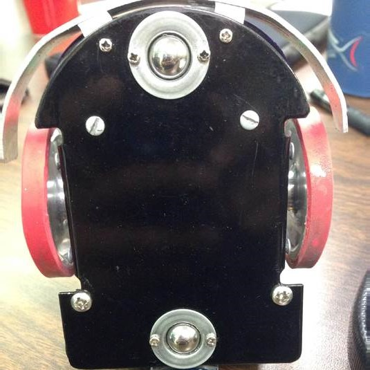
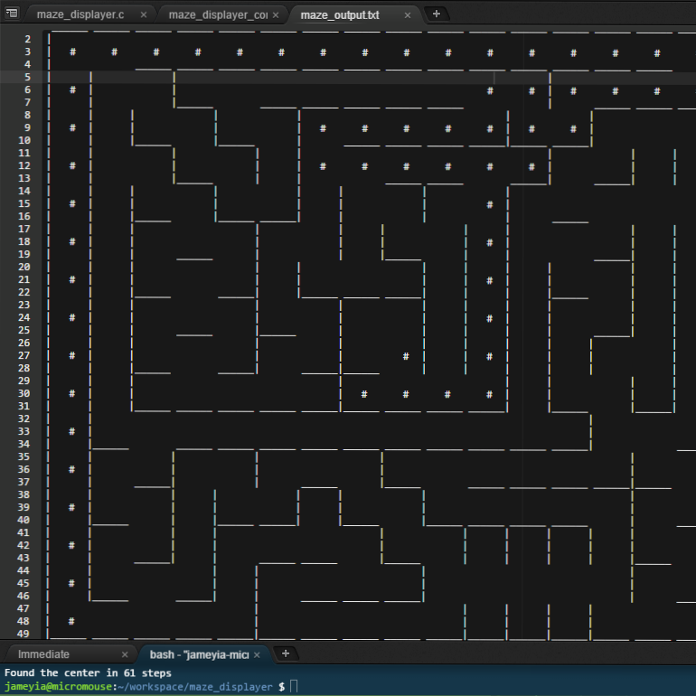

  
  
  
  

Micromouse is an event where small robot “mice” solve a 16 x 16 maze.  Events are held worldwide.  The maze is made up of a 16 by 16 gird of cells, each 180 mm square with walls 50 mm high.  The mice are completely autonomous robots that must find their way from a predetermined starting position to the central area of the maze unaided.  The mouse will need to keep track of where it is, discover walls as it explores, map out the maze and detect when it has reached the center.  having reached the center, the mouse will typically perform additional searches of the maze until it has found the most optimal route from the start to the center.  Once the most optimal route has been determined, the mouse will run that route in the shortest possible time.

Our team was named the Un-Farad-Vantage, an appropriately so, as our team consisted of two sophomores, one junior (myself), and a senior who was a veteran micromouse participant. Our robot was driven by two stepper motors and used for IR rangefinders to detect the walls. We had two sensors pointing straight ahead to detect an approachin wall in front, and two IR sensors angled 45 degrees from the normal to detect the side walls in advance.

Our team did not perform as well as it could have due to technical issues associated with our robot. Also, we had issues with our special high current stepper motor drivers and we had to wait a long time to get them replaced, which slowed down progress. We came in ahead of four other teams but ultimately placed 9th in the rankings.

You can learn more at the [UH Micromouse Website](http://www-ee.eng.hawaii.edu/~mmouse/about.html).

