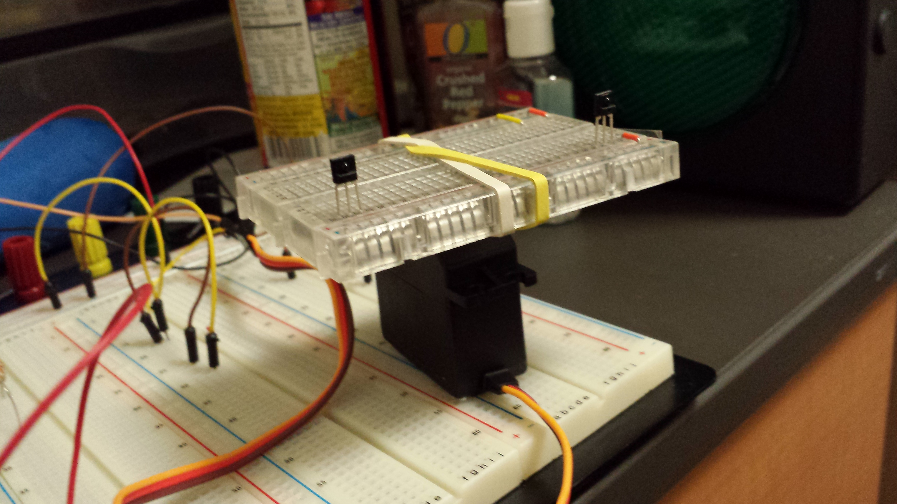
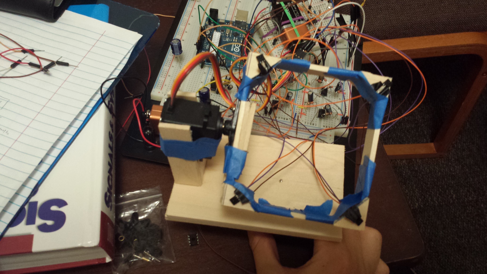

I was inspired to create a system to automatically pan and tilt a camera to track a subject after watching my EE 371 professor demonstrate a small piece of technology. He would often record his lectures so that students who couldn't make every class session would have something to review on their own schedule.

His apparatus consisted of a large plastic button that used radio waves as a means to provide a source that sensors on a camera mount could detect and adjust the pan and tilt of the camera to ensure the subject was always in frame. This however, was too bulky and I thought that I could build a better system for my EE 296 sophomore project.

I experimented with using just two infra red sensors and a single infra red source to get a gauge on how accurate a two dimensional tracker could be, and how range the sensor could track at.

After conducting some initial experiements, I built an apparatus to simulat what a pan and tilt mechanism for a small camera would be. This time, we tracked along two axiis: one horizontal pan, and one vertical tilt. We used four infra red sensors and one infra red source.

The source was pulsed at a specific frequency to eliminate the risk of ambient and other resonant light source intefering with our measurements. Four bandpass filters were designed and built in hardware for each sensor, and the mapping algorithm was implemented in Arduino. The source code is available on [GitHub](github.com/jameyia/camera_mount).

Overall, the apparatus was able to track the source reliably for short distances, but it did not have the range I was expecting. The device worked reliably within a 1 foot radius from the source. After that, you could not detect the source anymore. I can see why my professor went with the other technology, but it was a good attempt and perhaps a challenge to take on again another day.
